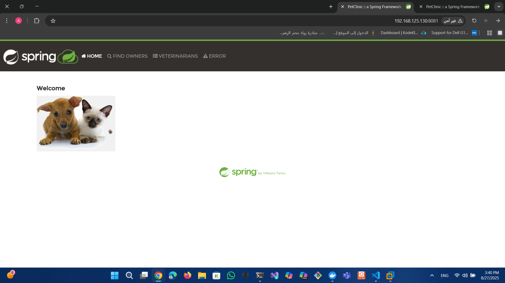
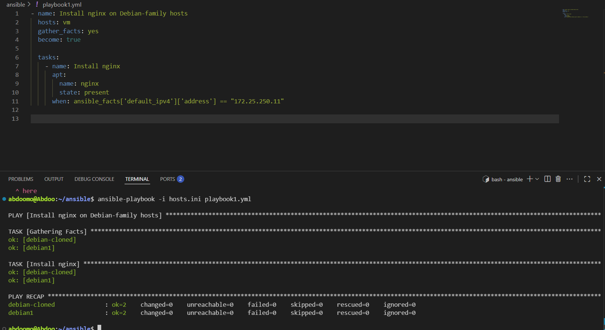

# 🐳 Deploying Spring Petclinic using Ansible and Docker on Debian VMs

This project demonstrates how to automate **Docker installation** and deploy the **Spring Petclinic** application on Debian VMs using **Ansible**.

---

## 1. Inventory File

The `hosts.ini` file contains all target VMs:

```ini
[vm]
debian1 ansible_host=192.168.125.131 ansible_user=abdoomo
debian-cloned ansible_host=192.168.125.130 ansible_user=ahmed
````

* `ansible_host`: The IP address of the VM
* `ansible_user`: The SSH user for connecting to the VM

---

## 2. Variables Used in the Playbook

```yaml
docker_users:
  - abdoomo
  - ahmed

spring_app_src: /home/abdoomo/ansible
spring_app_dest: "/home/{{ ansible_user }}/spring-app"
spring_app_port: 8081
```

* `docker_users`: Users added to the Docker group for container management
* `spring_app_src`: Path to Spring Petclinic files on the Ansible Controller
* `spring_app_dest`: Path to copy the application files on each VM
* `spring_app_port`: Port mapped on the VM (avoids conflicts with services like Nginx on 8080)

---

## 3. Playbook Overview

### A. Docker Installation

**1. Stop Docker if running**

```yaml
- name: Stop Docker service if running
  service:
    name: docker
    state: stopped
  ignore_errors: yes
```

**2. Remove old Docker**

```yaml
- name: Remove Docker package
  apt:
    name: docker.io
    state: absent
    purge: yes

- name: Remove Docker directories
  file:
    path: "{{ item }}"
    state: absent
  loop:
    - /var/lib/docker
    - /etc/docker
    - /var/run/docker.sock
    - /usr/bin/docker
  ignore_errors: yes
```

**3. Install Docker**

```yaml
- name: Install Docker package directly
  apt:
    name: docker.io
    state: latest
    update_cache: yes
```

**4. Ensure Docker is running and enabled**

```yaml
- name: Ensure Docker service is running
  service:
    name: docker
    state: started
    enabled: yes
```

**5. Add users to Docker group**

```yaml
- name: Add users to docker group
  user:
    name: "{{ item }}"
    groups: docker
    append: yes
  loop: "{{ docker_users }}"
```

---

### B. Deploy Spring Petclinic

**1. Create application directory**

```yaml
- name: Create application directory
  file:
    path: "{{ spring_app_dest }}"
    state: directory
    mode: '0755'
```

**2. Copy application files**

```yaml
- name: Copy Spring Petclinic files to VM
  copy:
    src: "{{ spring_app_src }}/"
    dest: "{{ spring_app_dest }}/"
    owner: "{{ ansible_user_id }}"
    group: "{{ ansible_user_gid }}"
    mode: '0644'
```

**3. Build Docker image**

```yaml
- name: Build Docker image for Spring Petclinic
  docker_image:
    name: spring-petclinic
    tag: latest
    build:
      path: "{{ spring_app_dest }}"
    state: present
```

**4. Run Docker container**

```yaml
- name: Run Spring Petclinic container
  docker_container:
    name: spring-petclinic
    image: spring-petclinic:latest
    state: started
    restart_policy: always
    published_ports:
      - "{{ spring_app_port }}:8080"
```

> `spring_app_port` ensures the app uses a port that does not conflict with existing services.

---

## 4. Running the Playbook

```bash
ansible-playbook -i hosts.ini docker-task.yml --ask-become-pass
```

* Enter the sudo password for each VM.
* The playbook will:

  1. Install Docker
  2. Copy Spring Petclinic files
  3. Build the Docker image
  4. Run the container

📸 Example output:


---

## 5. Access the Application

After deployment:

* **VM: debian1** → [http://192.168.125.131:8081](http://192.168.125.131:8081)
  

* **VM: debian-cloned** → [http://192.168.125.130:8081](http://192.168.125.130:8081)
  

---

## 🚀 Conditional Installation of Nginx with Ansible

This playbook shows how to install **Nginx** on Debian hosts only if their IP address matches a specific value.

---

### Files

* `hosts.ini` → Inventory file with hosts (`debian1`, `debian-cloned`)
* `playbook1.yml` → Main playbook

---

### Playbook Example

```yaml
- name: Install nginx on Debian-family hosts
  hosts: vm
  gather_facts: yes
  become: true

  tasks:
    - name: Install nginx
      apt:
        name: nginx
        state: present
      when: ansible_facts['default_ipv4']['address'] == "172.25.250.11"
```

---

### Commands

```bash
# Run the playbook
ansible-playbook -i hosts.ini playbook1.yml

# Gather facts from a specific host
ansible -i hosts.ini debian1 -m setup

# Gather only the default IP address
ansible -i hosts.ini debian1 -m setup -a "filter=ansible_default_ipv4"
```

---

### Output

* Facts were successfully gathered from both hosts ✅
* Nginx was already installed, so no changes were made (`changed=0`) ⚡

📸 Example:


```

---

تحب أخلي الـ README كله في **شيل بلوك واحد** زي ما عملنا قبل كده عشان تقدر تعمله Copy مرة واحدة، ولا تخليه منسق كده sections منفصلة؟
```


